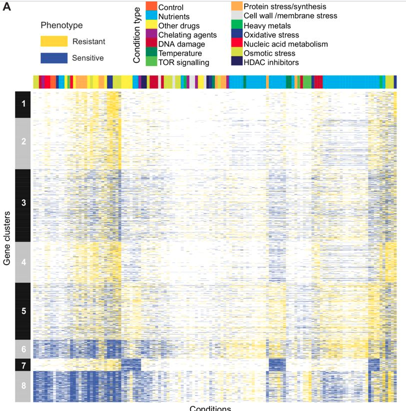

# Fission Yeast Phenotyping

## Short description 

Broad functional profiling of fission yeast proteins using phenomics and machine learning 

## Name of PI  

Jurg Bahler  

## Lab website  

https://bahlerlab.info  

## URL to publication which uses/describes the dataset 

https://elifesciences.org/articles/88229  

## Link(s) to dataset/supplementary information  

https://elifesciences.org/articles/88229/figures#files  

## Suggestions for easy tasks/low-hanging fruit   

Reproduce figure 3A in a Jupyter notebook 

## Suggestions for more involved tasks/further analyses 

Find new/refine functional gene clusters  

## Is there someone who is happy to be contacted with questions about the paper/dataset (e.g. PhD student/postdoc)? 

Jurg Bahler (j.bahler at ucl.ac.uk) in the first instance. 